# Ingress

## Ingress とは？

Ingress は `Ingress リソース` および `Ingress Controller` などを指す。  
Ingress リソースは `kind: Ingress` の マニフェスト を登録することで作成され、その登録時に何らかの処理を行うものが Ingress Controller である。
これらにより、ノーマルな Service では実現困難なより高機能なロードバランシングが可能となる。Ingress は L7 のロードバランシングをサポートする。

| LB の種類 |                 機能                  | 例                               |
| :-------: | :-----------------------------------: | -------------------------------- |
|    L4     | IP アドレスとポート番号による負荷分散 | AWS の Application Load Balancer |
|    L7     |    URL や HTTP ヘッダーで負荷分散     | AWS の Network Load Balancer     |

## Ingress の種類

アーキテクチャの観点から 2 つに大別される。

### 1. GKE Ingress

クラスタ外にロードバランサを立てるもの。

```title="トラフィックの流れ"
外部のロードバランサ(GCLB) -> (NodePort 経由) -> 転送先の Pod
```



### 2. Nginx Ingress

クラスタ内にロードバランサを立てるもの。

```title="トラフィックの流れ(Nginx Ingress)"
LoadBalancer Service -> Nginx Pod(Nginx Ingress Controller) -> 転送先の Pod
```



こちらのパターンの場合、考慮しなければならない点が多く、Ingress 用 Pod に外部からアクセスさせるために LoadBalancer Service を立てたり、Ingress 用の Pod に処理が集中することを想定してオートスケーリングを考慮する必要も出てくる。

## Ingress Controller のデプロイ

### 1. GKE Ingress

クラスタ作成時に `HttpLoadBalancer` アドオンを有効化する(デフォルトでそうなっている)。

### 2. Nginx Ingress

`Nginx Ingress Controller` をデプロイする。

```title=""
$ kubectl apply -f https://raw.githubusercontent.com/kubernetes/ingress-nginx/controller-v1.3.1/deploy/static/provider/cloud/deploy.yaml
```

また、以下の点にも注意されたし。

-   LoadBalancer Service の作成
-   ルールに一致しない場合のデフォルトの転送先 Deployment の作成
    -   トラフィックに応じて Pod 数を変えらえるように、`Horizontal Pod Autoscaler` の利用を検討

## Ingress リソースの作成

-   「リクエストパス + Service バックエンド」のペアで指定する。
-   1 つの IP アドレスで複数ホスト名を扱える。
-   「GKE タイプ」と「Nginx タイプ」で定義可能な設定は大体同じ。

以下では、2. Nginx Ingress の場合の例を示す。

```yaml title="ingress-nginx.yaml" hl_lines="9-27"
apiVersion: networking.k8s.io/v1
kind: Ingress
metadata:
    name: ingress-myservicea
    annotations:
        # Nginx Ingress ではデフォルトで HTTP -> HTTPS へリダイレクトされるため、今回はそれを OFF
        nginx.ingress.kubernetes.io/ssl-redirect: "false"
spec:
    rules:
        - host: myservice.foo.org
          http:
              paths:
                  - path: /path1/*
                    pathType: Prefix
                    backend:
                        service:
                            name: myservice1
                            port:
                                number: 80
                  - path: /path2/*
                    pathType: Prefix
                    backend:
                        service:
                            name: myservice2
                            port:
                                number: 80
    ingressClassName: nginx
```

<!-- ### X-Forwarded-For ヘッダによるクライアント IP アドレスの参照 -->

### Ingress Class による Ingress の分割

Nginx Ingress Controller を利用する場合、適切な Ingress リソースを見つける際に衝突してしまう可能性がある。クラスを設定することでこれを避ける。

```yaml
# kubernetes < 1.19
metadata:
    name: ingress-myserviceb
    annotations:
        kubernetes.io/ingress.class: "nginx"

# kubernetes >= 1.19.x
ingressClassName: nginx
```
